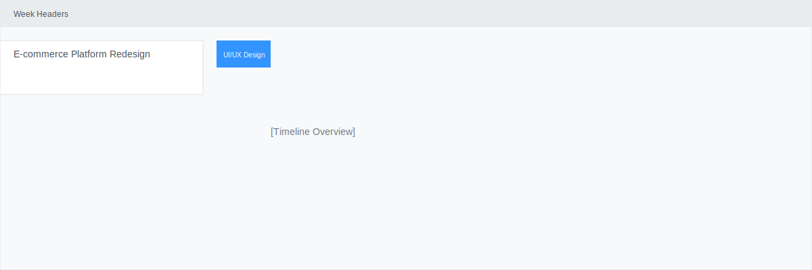
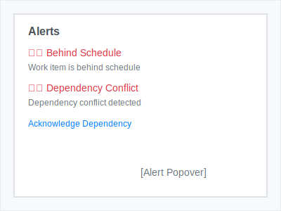
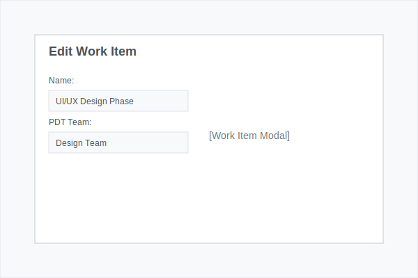
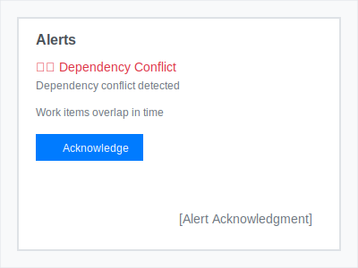

# Portfolio Management Tool - User Guide

> **📸 Screenshots Note**: The images in this guide are currently placeholder SVGs. To capture real screenshots of the application, please refer to the [Screenshot Capture Guide](scripts/capture-screenshots.md) for detailed instructions on capturing actual application screenshots.

## 📖 Table of Contents

1. [Getting Started](#getting-started)
2. [Project Roadmap](#project-roadmap)
3. [PDT Team Capacity](#pdt-team-capacity)
4. [Work Item Management](#work-item-management)
5. [Alert System](#alert-system)
6. [Filtering and Search](#filtering-and-search)
7. [Tips and Best Practices](#tips-and-best-practices)

## 🚀 Getting Started

### Accessing the Application

**Live Demo**: [Portfolio Management Tool](https://jordan-ryan.github.io/Portfolio-Management-Tool/)

### Main Navigation

The application has two main sections accessible via the top navigation bar:

- **Project Roadmap** - Interactive timeline view of all projects and work items
- **PDT Team Capacity** - Capacity planning and team monitoring

## 📅 Project Roadmap

The Project Roadmap is the main view of the application, providing an interactive timeline of all projects and their associated work items.

### Timeline Overview

The timeline displays:
- **Week Headers**: Date ranges for each week
- **Project Groups**: Expandable/collapsible project sections
- **Work Items**: Colored bars representing individual work items
- **Current Date Line**: Dotted line showing the current week

### Work Item Display

Each work item appears as a colored bar on the timeline showing:
- **Work Item Name**: Displayed on the bar
- **PDT Team**: Team assigned to the work item
- **Capacity Percentage**: Allocation percentage
- **Alert Icons**: ⚠️ indicates issues requiring attention

### Interacting with Work Items

#### **Viewing Work Item Details**
1. **Single-click** on any work item bar
2. The work item modal will open with all details
3. View/edit name, dates, capacity, team, and dependencies

#### **Moving Work Items**
1. **Click and hold** on a work item for 1 second
2. **Drag** the work item to the desired week
3. **Release** to drop the work item in its new position
4. The work item's dates will automatically update

#### **Alert Management**
- Click the ⚠️ icon on work items to view detailed alerts
- Alerts show specific issues and recommended actions
- Use "Acknowledge Dependency" to dismiss dependency alerts

### Project Expansion

Projects can be expanded to show more details:

1. **Click the arrow** next to a project name
2. **Expanded view shows**:
   - **Backlog Column**: Work items not yet scheduled
   - **Timeline Area**: Scheduled work items on the timeline

## 👥 PDT Team Capacity

The PDT Team Capacity page provides detailed capacity planning and monitoring for all teams.

### Capacity Table Overview

The capacity table displays:
- **Team Rows**: Each PDT team has its own row
- **Week Columns**: Capacity for each week
- **Color Coding**: Visual indicators for capacity levels
- **Overflow Indicators**: Shows +X% or -X% for capacity differences

### Capacity Color Coding

- **🟢 Green**: Under capacity (< 80%)
- **🟡 Yellow**: Near capacity (80-100%)
- **🔴 Red**: Over capacity (> 100%)

### Capacity Management

#### **Understanding Capacity**
- Capacity is shown as percentages (e.g., 80% max)
- Teams can be over-allocated (showing >100%)
- Overflow indicators show exact capacity differences

#### **Weekly Tracking**
- Monitor capacity changes week by week
- Identify over-allocated teams
- Plan resource allocation

## 🔧 Work Item Management

### Work Item Modal

The work item editing modal provides comprehensive management capabilities.

#### **Basic Information Tab**

**Fields to Edit**:
- **Name**: Work item title
- **Start Date**: When the work item begins
- **End Date**: When the work item should complete
- **Duration**: Automatically calculated from dates
- **Capacity**: Percentage allocation (0-100%)
- **PDT Team**: Assigned team
- **Completion**: Progress percentage (0-100%)

#### **Dependencies Tab**

**Predecessors (Dependencies)**:
- Shows work items that must be completed before this item
- Click "Remove" to delete dependencies
- Use "Add Dependency" to create new dependencies

**Successors (Dependents)**:
- Shows work items that depend on this item
- Click "Remove" to delete dependents
- Use "Add Dependency" to create new dependencies

#### **Adding Dependencies**

1. **Click "Add Dependency"** button
2. **Choose dependency type**:
   - **Predecessor**: Work item that must complete first
   - **Successor**: Work item that depends on this item
3. **Search by ID or name** in the search box
4. **Select the desired work item** from the dropdown
5. **Click "Add"** to create the dependency

## 🚨 Alert System

The application automatically detects and alerts on various issues.

### Alert Types

#### **1. Behind Schedule**
- **Trigger**: Work items past their end date
- **Action**: Update end date or mark as complete

#### **2. Past Work Incomplete**
- **Trigger**: Past work items not 100% complete
- **Action**: Update completion percentage to 100%

#### **3. Dependency Conflicts**
- **Trigger**: Overlapping work item dependencies
- **Action**: Review and adjust dependencies or acknowledge

#### **4. Progress Delays**
- **Trigger**: Work items behind their expected progress
- **Action**: Update progress or extend timeline

### Alert Management

#### **Viewing Alerts**
1. **Click the ⚠️ icon** on any work item
2. **Review alert details** in the popover
3. **Take appropriate action** based on the alert type

#### **Acknowledging Dependencies**
- For dependency conflicts, click "Acknowledge Dependency"
- This dismisses the specific alert for that dependency
- Acknowledged dependencies won't show alerts again

## 🔍 Filtering and Search

### Multi-Select Filtering

The application supports filtering by both PDT teams and projects.

#### **PDT Team Filter**
1. **Click the "PDT Team" dropdown** in the top toolbar
2. **Select multiple teams** to filter by
3. **Use "Clear Filter"** to remove all filters

#### **Project Filter**
1. **Click the "Project" dropdown** in the top toolbar
2. **Select multiple projects** to filter by
3. **Use "Clear Filter"** to remove all filters

### Filter Behavior

- **Multi-select**: Choose multiple teams/projects
- **Visual feedback**: Filtered items are highlighted
- **Clear filters**: Use "Clear Filter" to reset
- **Combined filters**: PDT and project filters work together

## 💡 Tips and Best Practices

### Work Item Management

#### **Creating Work Items**
1. **Use descriptive names** for easy identification
2. **Set realistic durations** based on team capacity
3. **Assign appropriate capacity** percentages
4. **Set dependencies** to show relationships

#### **Timeline Planning**
1. **Review capacity** before adding new work items
2. **Check dependencies** to avoid conflicts
3. **Monitor alerts** regularly for issues
4. **Update progress** as work items advance

### Capacity Planning

#### **Team Allocation**
1. **Monitor weekly capacity** to avoid over-allocation
2. **Use color coding** to quickly identify issues
3. **Plan for peak periods** with extra capacity
4. **Balance workload** across teams

#### **Resource Management**
1. **Track overflow indicators** for exact capacity differences
2. **Adjust allocations** based on team performance
3. **Plan for holidays** and team availability
4. **Consider dependencies** when allocating resources

### Alert Management

#### **Regular Reviews**
1. **Check alerts daily** for new issues
2. **Address dependency conflicts** promptly
3. **Update completion percentages** regularly
4. **Acknowledge resolved issues** to reduce noise

#### **Preventive Actions**
1. **Set realistic end dates** to avoid "behind schedule" alerts
2. **Update progress regularly** to prevent delays
3. **Review dependencies** before creating new work items
4. **Monitor capacity** to prevent over-allocation

### Keyboard Shortcuts

- **Escape**: Close modals and popovers
- **Enter**: Save changes in forms
- **Tab**: Navigate between form fields
- **Mouse wheel**: Zoom timeline in/out
- **Click and drag**: Pan timeline

### Performance Tips

1. **Limit concurrent work items** per team
2. **Use filters** to focus on specific teams/projects
3. **Collapse projects** when not needed
4. **Clear acknowledged alerts** to reduce clutter

## 🆘 Troubleshooting

### Common Issues

#### **Work Items Not Moving**
- **Solution**: Hold for 1 second before dragging
- **Check**: Ensure you're clicking on the work item bar, not the alert icon

#### **Alerts Not Showing**
- **Solution**: Refresh the page
- **Check**: Ensure work items have valid dates and dependencies

#### **Capacity Not Updating**
- **Solution**: Check work item dates and capacity percentages
- **Check**: Ensure PDT team assignments are correct

#### **Filters Not Working**
- **Solution**: Clear all filters and reapply
- **Check**: Ensure you've selected valid teams/projects

### Getting Help

- **Check the documentation** for detailed instructions
- **Review alert messages** for specific guidance
- **Contact support** through GitHub issues
- **Refer to the implementation summary** for technical details

---

**Need more help?** Check the main [README.md](../README.md) for additional information and technical documentation. 